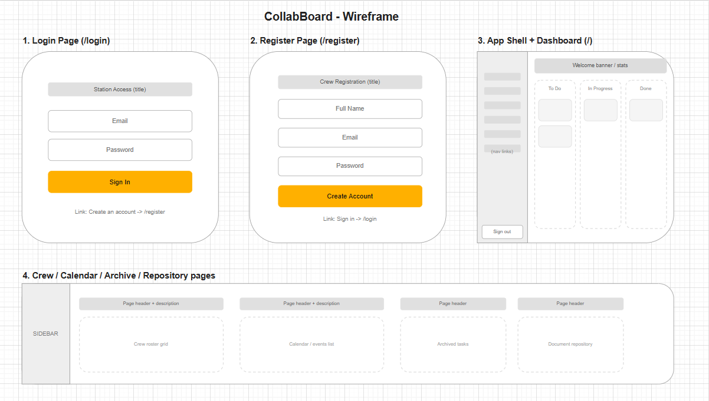
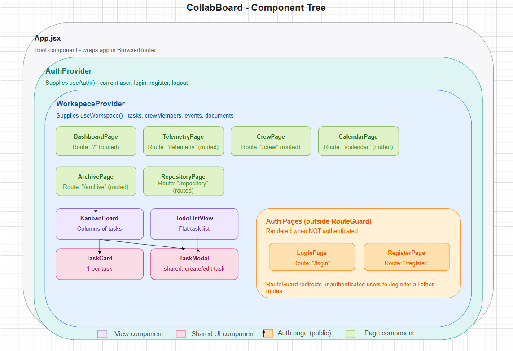

# CollabBoard

A collaborative team task board built with React — Assignment 01 (Static Front-End Skeleton).

## About

CollabBoard is a Kanban-style task management platform with a space-station mission control theme. It lets a small team create tasks, move them between columns (To Do / In Progress / Done), manage crew members, schedule events, and track project documents.

## Tech Stack

- React 18 + Vite
- React Router
- Lucide React (icons)

## Team

| Member | Responsibility |
|---|---|
| Member 1 - SK Kavindi      | Authentication & Access Control (Login, Register & Route Guard) |
| Member 2 - IDRT Sanjeewa   | Kanban Mission Deck (Task Board & Edit Task Modal) |
| Member 3 - WRN Wijesooriya | To-Do List Module & Main Mission Dashboard View |
| Member 4 - PO Karunapala   | Crew Roster & Astronaut Directory Management |
| Member 5 - KDP Udeepa      | Telemetry Analytics & Real-Time System Metrics |
| Member 6 - HMYN Madugalla  | Mission Calendar & Event Scheduler |
| Member 7 - MKI Dewmini     | Document Repository & Mission Archives |
| Member 8 - AGK Imansha     | Cockpit App Layout, Sidebar Navigation, Settings & Global Themes |

## How to Run

\`\`\`bash
npm install
npm run dev
\`\`\`

Then open the local URL shown in the terminal (usually `http://localhost:3001`).

## Wireframe & Component Tree

### Wireframe

### Component Tree
